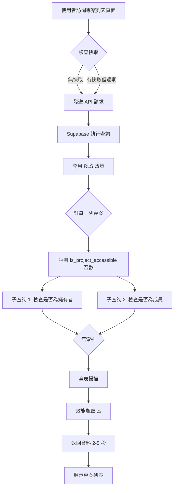
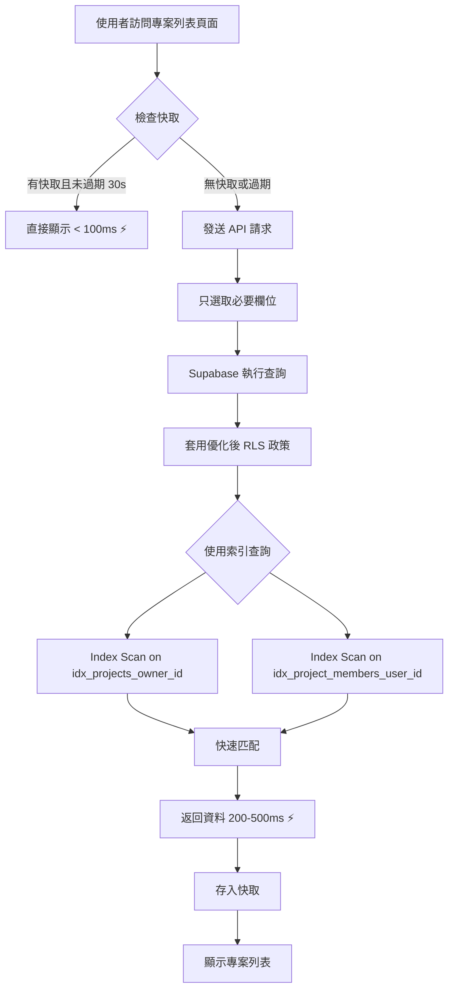
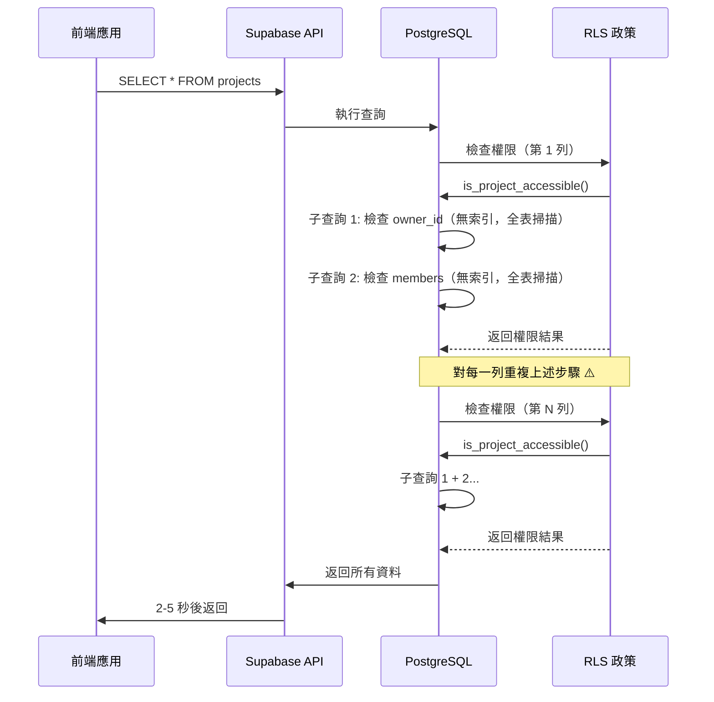
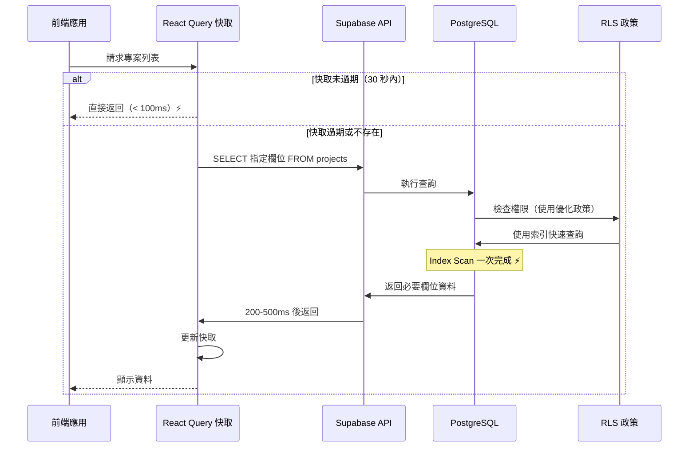
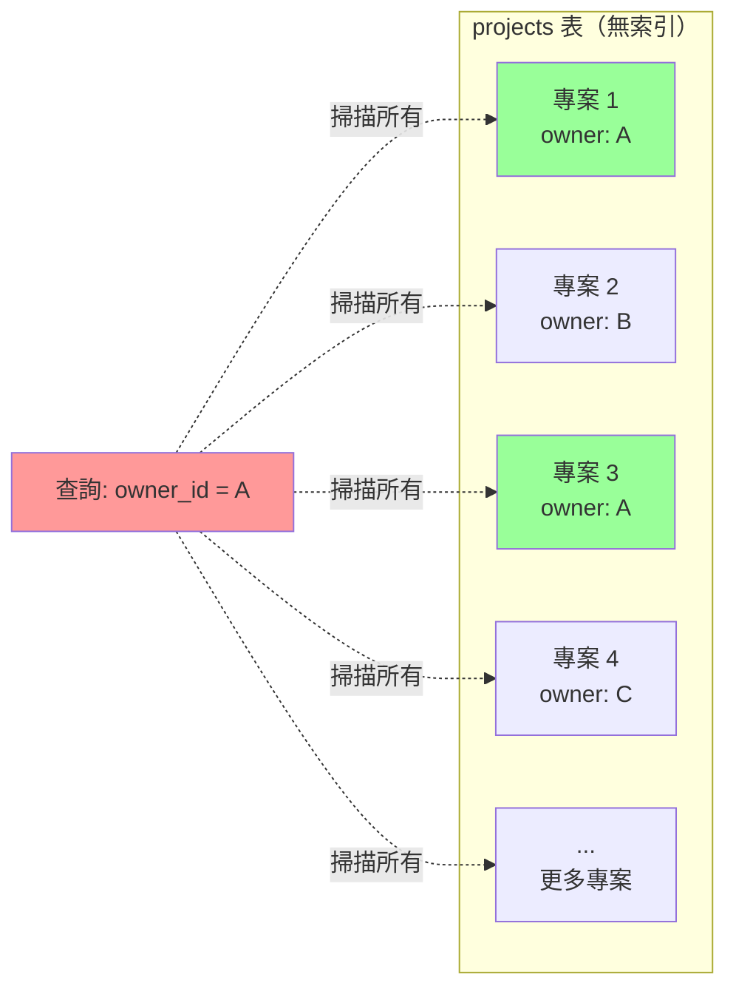
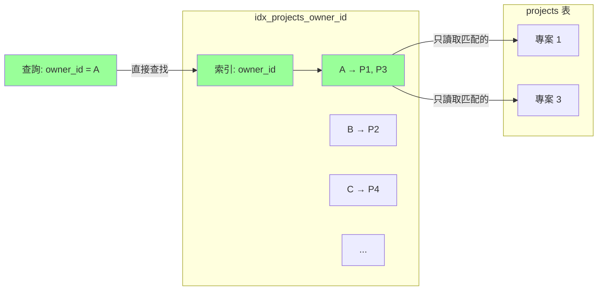
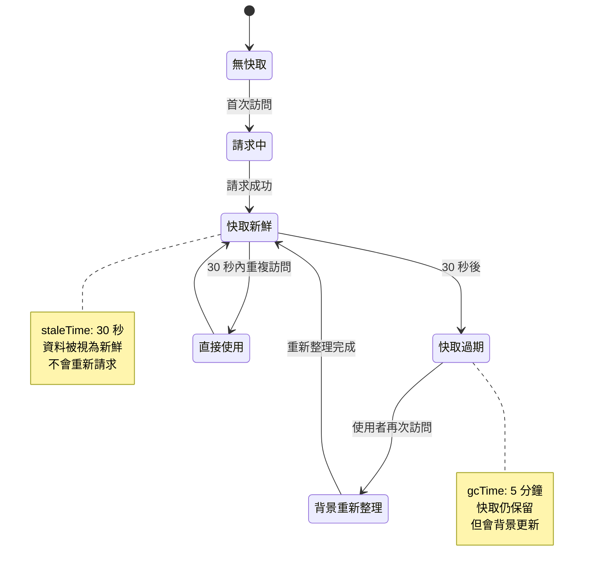
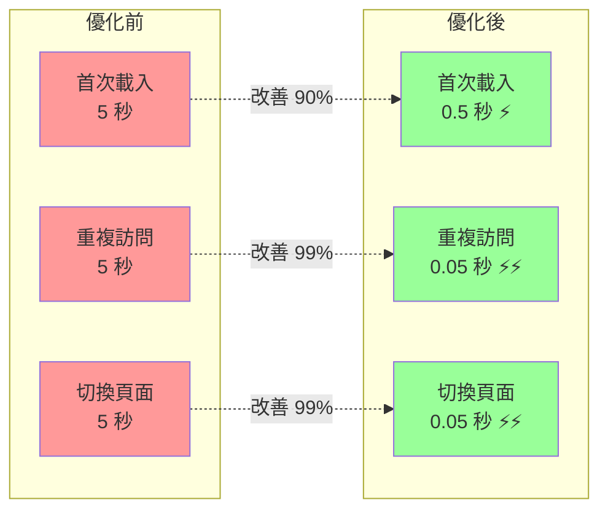
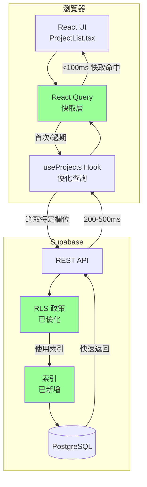
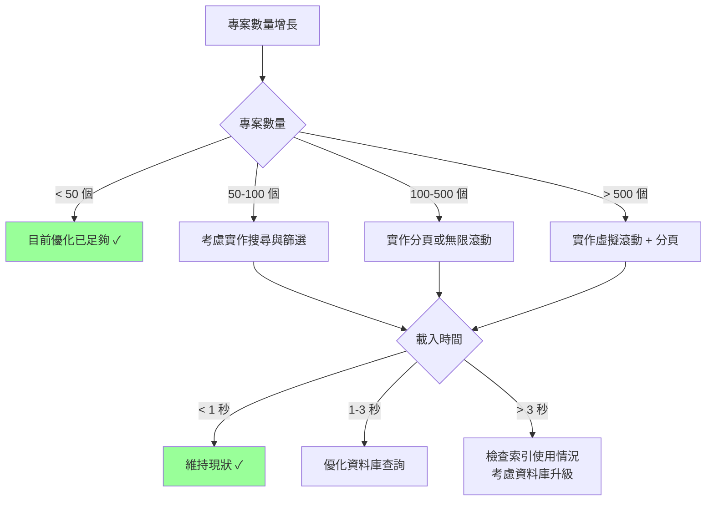

# 載入優化流程圖

## 問題診斷流程

## 優化後的流程

## 資料庫查詢優化對比

### 優化前（慢）

### 優化後（快）

## 索引優化示意圖

### 無索引（全表掃描）

### 有索引（Index Scan）

## 快取策略流程

## 效能改善視覺化

## 系統架構圖

## 決策樹：何時需要進一步優化

---

## 補充說明

### 符號說明
- ⚡ = 效能優化點
- ⚠️ = 效能瓶頸
- ✓ = 推薦方案

### 關鍵指標
- **首次載入**：使用者首次訪問頁面的時間
- **快取命中**：使用快取資料，近乎即時
- **背景重新整理**：快取過期後在背景更新，使用者無感

### 測量工具
1. **瀏覽器 DevTools**：Network 標籤查看實際請求時間
2. **React Query DevTools**：監控快取狀態
3. **Supabase Dashboard**：Performance Insights 查看資料庫效能
