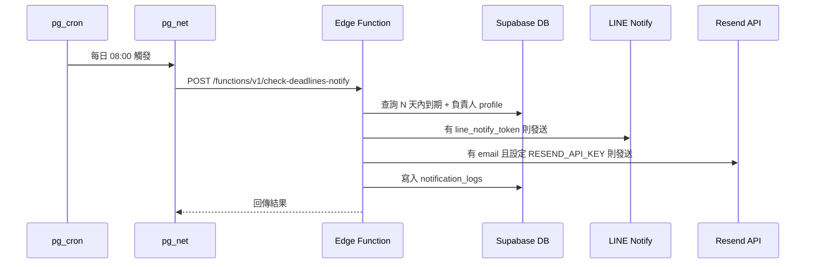

# Phase 2：通知（排程檢查、LINE Notify、Email）

排程檢查「N 天內到期」的截止日，對負責人發送 **LINE Notify** 與／或 **Email**（Resend），並寫入 `notification_logs` 供排查。

## 架構概覽



## 一、資料庫

### 1.1 執行 Migrations

依序執行（雲端專案可於 SQL Editor 貼上執行）：

1. `supabase/migrations/20250209000004_notification_logs.sql` — 建立 `notification_logs` 表與 RLS。
2. （可選）`supabase/migrations/20250209000005_cron_invoke_notify.sql` — 每日 08:00 呼叫 Edge Function。  
   **前置**：已啟用 **pg_cron**、**pg_net**，且於 **Vault** 建立下列 secret（見下方）。

### 1.2 啟用 pg_cron / pg_net

- **Dashboard**：Integrations → Cron → 啟用；Database → Extensions → 啟用 `pg_net`。
- **SQL**：
  ```sql
  create extension if not exists pg_cron with schema pg_catalog;
  create extension if not exists pg_net;
  grant usage on schema cron to postgres;
  ```

### 1.3 Vault 設定（供排程呼叫 Edge Function）

在 **Dashboard → Project Settings → Vault**（或 SQL）建立：

| 名稱 | 說明 |
|------|------|
| `project_url` | Supabase 專案 URL，例如 `https://xxxxx.supabase.co`（結尾勿加 `/`） |
| `publishable_key` | anon / publishable key（用於 Authorization: Bearer） |
| `cron_secret` | （可選）若 Edge Function 有設 `CRON_SECRET`，請設相同值，排程會帶在 body 的 `secret` |

SQL 範例：

```sql
select vault.create_secret('https://你的專案-ref.supabase.co', 'project_url', 'Supabase project URL');
select vault.create_secret('你的_anon_或_publishable_key', 'publishable_key', 'API key for cron');
-- 可選：select vault.create_secret('自訂密碼', 'cron_secret', 'Secret for Edge Function');
```

## 二、Edge Function：check-deadlines-notify

### 2.1 部署

- **Supabase Dashboard**：Edge Functions → Create function → 名稱 `check-deadlines-notify`，貼上 `supabase/functions/check-deadlines-notify/index.ts` 內容後部署。
- **CLI**：於專案根目錄執行（Git Bash 請用 `/c/Users/...` 路徑）  
  `supabase functions deploy check-deadlines-notify`
- **無 CLI 時**：Dashboard → Edge Functions → 選擇或建立 `check-deadlines-notify` → 貼上 `supabase/functions/check-deadlines-notify/index.ts` 內容後 Deploy

### 2.2 環境變數（Dashboard → Edge Functions → 該函數 → Settings）

| 變數 | 必填 | 說明 |
|------|------|------|
| `SUPABASE_URL` | 是 | 通常由 Supabase 自動注入 |
| `SUPABASE_SERVICE_ROLE_KEY` | 是 | 通常由 Supabase 自動注入 |
| `DAYS_BEFORE` | 否 | 幾天內到期要提醒，預設 `3` |
| `RESEND_API_KEY` | 否 | Resend API Key；未設則只發 Email 不送信 |
| `NOTIFY_FROM_EMAIL` | 否 | 發信者 Email（需為 Resend 驗證過的網域），預設 `notify@resend.dev` |
| `CRON_SECRET` | 否 | 若設定，呼叫時需在 Header `Authorization: Bearer <CRON_SECRET>` 或 body `{"secret":"<CRON_SECRET>"}` |
| `LINE_CHANNEL_ACCESS_TOKEN` | 否 | LINE Messaging API 的 Channel access token（發行長期 token）；未設則改用 profile 的 line_notify_token（LINE Notify） |

### 2.3 邏輯摘要

- 查詢 `due_date` 在「今天」～「今天 + DAYS_BEFORE」且 `assignee_id` 不為空的 `deadlines`，並帶出專案名稱與負責人 `profiles`（email、line_notify_token）。
- 同一 deadline 同一天同一管道（LINE／Email）只發一次（依 `notification_logs` 判斷）。
- **LINE**：負責人 `profiles.line_notify_token` 有值則呼叫 LINE Notify API。
- **Email**：負責人 `profiles.email` 有值且已設 `RESEND_API_KEY` 則呼叫 Resend API。
- 每次成功發送皆寫入一筆 `notification_logs`（deadline_id、recipient、channel、sent_at）。

## 三、負責人與通知管道

- **LINE Messaging API**（優先）：Edge Function 設 `LINE_CHANNEL_ACCESS_TOKEN`，profile 填 `line_user_id`（使用者的 LINE userId，加 Bot 為好友後從 Webhook 或 LINE Login 取得）。發送使用 Push Message API。
- **LINE Notify**（備援）：profile 填 `line_notify_token`（從 [LINE Notify](https://notify-bot.line.me/) 取得）。
- **Email**：profile 的 `email`；需在 Edge Function 設定 `RESEND_API_KEY` 與 `NOTIFY_FROM_EMAIL`。

（前端需提供「個人設定」讓使用者填寫 email、line_notify_token 或綁定 LINE 取得 line_user_id。）

## 四、手動觸發測試

Supabase 會先驗證 **Authorization: Bearer** 為專案的 anon key（JWT，`eyJ...`），再執行函數；若設了 `CRON_SECRET`，函數內會再檢查 body 的 `secret` 或 Bearer 是否等於 `CRON_SECRET`。建議：**Authorization 用 anon key**，**CRON_SECRET 放 body**。

```bash
# 未設 CRON_SECRET：Authorization 用 anon key（JWT）
curl -X POST "https://你的專案-ref.supabase.co/functions/v1/check-deadlines-notify" \
  -H "Content-Type: application/json" \
  -H "Authorization: Bearer 你的_anon_key_eyJ開頭" \
  -d "{}"

# 有設 CRON_SECRET：Authorization 仍用 anon key，secret 放 body
curl -X POST "https://你的專案-ref.supabase.co/functions/v1/check-deadlines-notify" \
  -H "Content-Type: application/json" \
  -H "Authorization: Bearer 你的_anon_key_eyJ開頭" \
  -d '{"secret":"你的CRON_SECRET"}'
```

成功時回傳範例：`{"ok":true,"sent":2,"deadlines_checked":3}`。

## 五、排程時間

- Migration 預設為 **每日 08:00 UTC**（`0 8 * * *`）。
- 若要改為台灣時間 08:00：UTC 為 00:00，可改為 `0 0 * * *`（依 Supabase 主機時區為準），或依需求調整 cron 表達式。

## 六、通知紀錄

- 表：`notification_logs`（id, deadline_id, recipient, channel, sent_at）。
- 具專案存取權限的使用者可讀取（RLS 依 deadline → project 判斷）。
- 可於前端實作「通知紀錄」列表，或於 Table Editor / SQL 查詢排查。
