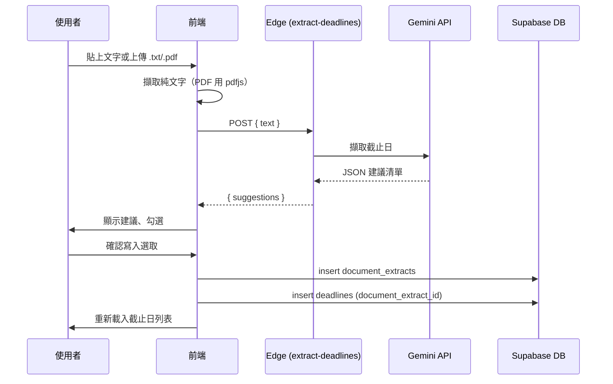

# Phase 3 — 文件與 AI 擷取截止日

## 功能摘要

- **檔案／文字輸入**：在專案詳情頁可貼上文字或上傳 `.txt` / `.pdf`，由前端擷取純文字後送交 Edge Function。
- **AI 擷取**：Edge Function `extract-deadlines` 使用 **Google Gemini API** 從文字中辨識專案／里程碑／截止日，回傳結構化建議清單。
- **建議寫入**：前端顯示「建議截止日」列表，可勾選後一次寫入專案截止日（會建立一筆 `document_extracts` 紀錄並關聯多筆 `deadlines`）。

## 資料庫

- **document_extracts**：單次擷取批次（`project_id`、`file_name`、`extract_result` JSONB、`created_by`）。  
  Migration：`supabase/migrations/20250210140000_document_extracts.sql`
- **deadlines**：新增 FK `document_extract_id` → `document_extracts(id)`，寫入時可帶 `source: 'document_extract'`。

## Edge Function：extract-deadlines

- **驗證**：`verify_jwt = true`，需登入。
- **環境變數**：在 Supabase Dashboard → Edge Functions → extract-deadlines → Settings 設定 **GEMINI_API_KEY**（Google AI Studio 或 Cloud 取得）。
- **請求**：`POST`，body `{ "text": "文件內容..." }`。
- **回應**：`{ "suggestions": [ { "title", "due_date", "description?", "assignee_name?" } ] }`。

部署：

```bash
cd c:\Users\JoJo\Documents\Project\ToDo
supabase functions deploy extract-deadlines
```

並在 Dashboard 為該 function 設定 `GEMINI_API_KEY`。

## 前端

- 專案詳情頁新增區塊「從文件擷取截止日」：文字框 + 檔案選擇（.txt / .pdf）、「開始擷取」、建議列表（可勾選）、「確認寫入選取」。
- PDF 文字擷取使用 `pdfjs-dist`（動態 import），僅在選擇 PDF 時載入。

## 流程概覽


