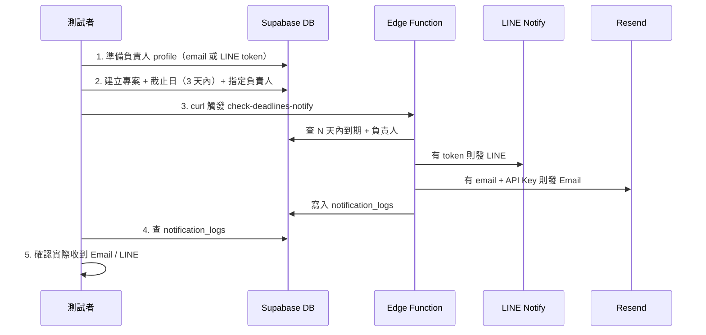

# 截止日通知測試流程

## 流程概覽



---

## 測試前所需資訊（請先提供）

| 項目 | 說明 | 範例 |
|------|------|------|
| **Supabase 專案 URL** | Dashboard → Project Settings → API → Project URL | `https://xxxxx.supabase.co` |
| **anon / publishable key** | 用於 curl 的 `Authorization: Bearer` | `eyJ...` |
| **CRON_SECRET**（若有設） | Edge Function 設定的密碼，用於驗證 | 自訂字串 |
| **負責人 auth.users.id** | 已有帳號的 user id（或要新建測試帳號） | UUID |
| **負責人 email** | 要收測試信的信箱（需在 profiles 有值） | `test@example.com` |
| **負責人 LINE token**（可選） | 從 [LINE Notify](https://notify-bot.line.me/) 取得的 Token | 若只測 Email 可留空 |

---

## Step 1：準備負責人（profile 有 email 或 LINE token）

若已有登入過的使用者，`handle_new_user` 會自動建立 profile，但 **email** 與 **line_notify_token** 需手動或透過前端填寫。

### 方式 A：使用既有 auth 使用者

在 **SQL Editor** 執行（請替換 `使用者UUID`、`test@example.com`、可選的 LINE token）：

```sql
-- 更新既有使用者的 profile（假設 auth.users 已有該使用者）
UPDATE public.profiles
SET
  email = 'test@example.com',
  line_notify_token = NULL,  -- 或 '你的LINE_NOTIFY_TOKEN'
  display_name = '測試負責人'
WHERE id = '使用者UUID';
```

### 方式 B：沒有使用者時，先建測試使用者（需 Dashboard 或 Auth API）

1. 在 **Dashboard → Authentication → Users** 新增一筆 User（或用 Sign up API）。
2. 複製該使用者的 **UUID**。
3. 若 `handle_new_user` 已建立 profile，用上面 `UPDATE` 補上 `email` / `line_notify_token`；若無 profile 可手動插入：

```sql
INSERT INTO public.profiles (id, display_name, email, line_notify_token)
VALUES (
  '剛建立的用戶UUID',
  '測試負責人',
  'test@example.com',
  NULL  -- 或 '你的LINE_NOTIFY_TOKEN'
)
ON CONFLICT (id) DO UPDATE SET
  email = EXCLUDED.email,
  line_notify_token = EXCLUDED.line_notify_token,
  display_name = EXCLUDED.display_name;
```

---

## Step 2：建立專案 + 截止日（3 天內）並指定負責人

**負責人**必須是專案可存取者（owner 或 project_members），且 `deadlines.assignee_id` 要設成該負責人。

在 **SQL Editor** 執行（請替換 `負責人UUID`、`專案擁有者UUID`；截止日請落在「今天～今天+3 天」）：

```sql
-- 專案擁有者可與負責人同一人
INSERT INTO public.projects (id, name, description, owner_id)
VALUES (
  gen_random_uuid(),
  '測試專案-截止日通知',
  '用於驗證 Email/LINE 通知',
  '專案擁有者UUID'  -- 可與負責人相同
)
RETURNING id;  -- 記下 project_id

-- 將上面 RETURNING 的 project_id 代入下方，並設定截止日為「今天 + 2 天」
INSERT INTO public.deadlines (project_id, title, due_date, description, assignee_id)
VALUES (
  '上一步的project_id',
  '測試截止日',
  (CURRENT_DATE + INTERVAL '2 days')::date,
  '若收到此通知代表流程正常',
  '負責人UUID'
)
RETURNING id, project_id, title, due_date, assignee_id;
```

若專案已有 **project_members** 表且負責人非 owner，需把負責人加入成員：

```sql
INSERT INTO public.project_members (project_id, user_id)
VALUES ('專案UUID', '負責人UUID')
ON CONFLICT (project_id, user_id) DO NOTHING;
```

---

## Step 3：用 curl 觸發 Edge Function

在終端機執行（請替換實際 URL、key、若有用 CRON_SECRET 則二擇一）。

**未設 CRON_SECRET：**

```bash
curl -X POST "https://你的專案-ref.supabase.co/functions/v1/check-deadlines-notify" \
  -H "Content-Type: application/json" \
  -H "Authorization: Bearer 你的_anon_key" \
  -d "{}"
```

**有設 CRON_SECRET（Header）：**

```bash
curl -X POST "https://你的專案-ref.supabase.co/functions/v1/check-deadlines-notify" \
  -H "Content-Type: application/json" \
  -H "Authorization: Bearer 你的CRON_SECRET" \
  -d "{}"
```

**有設 CRON_SECRET（Body）：**

```bash
curl -X POST "https://你的專案-ref.supabase.co/functions/v1/check-deadlines-notify" \
  -H "Content-Type: application/json" \
  -H "Authorization: Bearer 你的_anon_key" \
  -d "{\"secret\":\"你的CRON_SECRET\"}"
```

成功時回應範例：`{"ok":true,"sent":2,"deadlines_checked":1}`（sent 依實際發送 LINE/Email 筆數）。

---

## Step 4：檢查 notification_logs 與實際收信

### 4.1 查 notification_logs

在 **SQL Editor** 執行：

```sql
SELECT id, deadline_id, recipient, channel, sent_at
FROM public.notification_logs
ORDER BY sent_at DESC
LIMIT 20;
```

預期：剛觸發的 deadline 會出現 `channel = 'line'` 和／或 `channel = 'email'` 的紀錄。

### 4.2 實際收信／收 LINE

- **Email**：到 `profiles.email` 的信箱收信（含垃圾信匣），標題約為 `[截止日提醒] 專案名 - 標題 (日期)`。
- **LINE**：若有填 `line_notify_token`，綁定該 Token 的 LINE 應收到通知。

---

## 常見問題

| 狀況 | 可能原因 |
|------|----------|
| `sent: 0`、`deadlines_checked: 0` | 沒有「due_date 在今日～今日+3 天」且 assignee_id 非空的 deadline；或查詢條件/時區不符 |
| `deadlines_checked: 1` 但 `sent: 0` | profile 沒有 email 且沒有 line_notify_token；或 Email 沒設 RESEND_API_KEY；或當日同 deadline 同 channel 已發過（防重複） |
| 有 notification_logs 但沒收到信 | Resend 寄出成功但被歸類垃圾信；或 NOTIFY_FROM_EMAIL 未驗證 |
| 401 Unauthorized | CRON_SECRET 有設但 curl 沒帶對；或 anon key 錯誤 |

---

## 一鍵檢查用 SQL（可選）

執行前請替換 `負責人UUID`，用於確認「該負責人是否有 3 天內的 deadline」與「今日是否已發過」：

```sql
-- 負責人 3 天內到期的 deadline
SELECT d.id, d.title, d.due_date, p.name AS project_name,
       pr.email, pr.line_notify_token IS NOT NULL AS has_line_token
FROM public.deadlines d
JOIN public.projects p ON p.id = d.project_id
LEFT JOIN public.profiles pr ON pr.id = d.assignee_id
WHERE d.assignee_id = '負責人UUID'
  AND d.due_date >= CURRENT_DATE
  AND d.due_date <= CURRENT_DATE + 3;

-- 今日已發送紀錄
SELECT nl.deadline_id, nl.channel, nl.recipient, nl.sent_at
FROM public.notification_logs nl
WHERE nl.sent_at >= CURRENT_DATE
  AND nl.sent_at < CURRENT_DATE + 1
ORDER BY nl.sent_at DESC;
```
